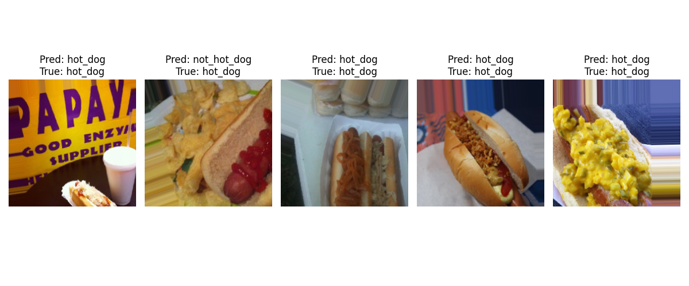

# 🧠 Convolutional Neural Networks Projects

Welcome! This report presents three creative CNN-based image classification projects. Each section includes an introduction, model summary, accuracy metrics, and example predictions.

---

## 📌 Navigation

- [1. Cats vs Dogs](#1-cats-vs-dogs)
- [2. Hotdog or Not](#2-hotdog-or-not)
- [3. Rock Paper Scissors](#3-rock-paper-scissors)

---

## 1. Cats vs Dogs

> 🐶🐱 Binary classification project to distinguish between cats and dogs using deep transfer learning.

### 🧠 Model Overview
This project uses **MobileNetV2**, a pre-trained convolutional neural network designed for image classification tasks. Instead of training a CNN from scratch, we use this model as a **feature extractor** and train only a small classification head on top.

#### Architecture:
- **Base model:** MobileNetV2 (pre-trained on ImageNet, frozen)
- **Input size:** 224 × 224 × 3
- **Top layers:**
  - `GlobalAveragePooling2D`
  - `Dropout(0.3)`
  - `Dense(1, activation='sigmoid')`
- **Optimizer:** Adam
- **Loss:** Binary cross-entropy
- **Callbacks:** EarlyStopping and ReduceLROnPlateau

---

### 📊 Training Results

Training was performed for **15 epochs**, using data augmentation and validation split of 20%. The model quickly reached high accuracy and generalization:

| Metric         | Value       |
|----------------|-------------|
| Train accuracy | **~99.5%**  |
| Val accuracy   | **~94.5%**  |
| Epochs         | 15          |

---

### 📈 Accuracy Graph

Accuracy for training and validation over epochs:

---

### 📃 Training Logs (Epochs)

Here is a snapshot of the training progress during the epochs:

---

### 📸 Example Predictions

The model performs very well in identifying both dogs and cats in unseen data. Below are five test samples with predictions:

> ✅ The model correctly identifies dogs and cats with high confidence. Even images with unusual lighting or angles are correctly classified.

---

## 2. Hotdog or Not

> 🌭❌ A fun binary classification task inspired by the classic “hotdog or not” meme.

### 🧠 Model Overview
We use **MobileNetV2** again as a base model and freeze its layers to serve as a feature extractor. The final classification is done through a small custom head.

#### Architecture:
- **Base model:** MobileNetV2 (frozen)
- **Input size:** 224 × 224 × 3
- **Top layers:**
  - `GlobalAveragePooling2D`
  - `Dropout(0.5)`
  - `Dense(64, activation='relu')`
  - `Dropout(0.3)`
  - `Dense(1, activation='sigmoid')`
- **Optimizer:** Adam
- **Loss:** Binary cross-entropy
- **Callbacks:** EarlyStopping

---

### 📊 Training Results

| Metric         | Value       |
|----------------|-------------|
| Train accuracy | **~90.1%**  |
| Val accuracy   | **~92.4%**  |
| Epochs         | 7           |

The model converged quickly with high validation accuracy thanks to data augmentation and transfer learning.

---

### 📈 Accuracy Graph

---

### 📃 Training Logs (Epochs)

---

### 📸 Example Predictions

The following test samples show the model’s ability to identify hotdogs:

> 🔍 The model achieved excellent accuracy. Only one image was misclassified, but overall performance was very strong.

---

## 3. Rock Paper Scissors

> ✊✋✌️ Multi-class image classification of hand gestures from the classic game.

### 🧠 Model Overview
A custom CNN model was built from scratch for this task, capable of distinguishing between **rock**, **paper**, and **scissors**. Data augmentation and dropout layers help with generalization.

#### Architecture:
- **Input size:** 100 × 100 × 3
- **Conv blocks:**
  - `Conv2D + BatchNorm + MaxPooling + Dropout` × 3
- **Dense head:**
  - `Flatten → Dense(256) → Dropout(0.4) → Dense(3, softmax)`
- **Optimizer:** Adam
- **Loss:** Categorical cross-entropy
- **Callbacks:** EarlyStopping

---

### 📊 Training Results

| Metric         | Value       |
|----------------|-------------|
| Train accuracy | **~99.6%**  |
| Val accuracy   | **~97.7%**  |
| Epochs         | 12          |

The model performed extremely well even on a small input size, due to effective data preprocessing and a well-structured architecture.

---

### 📈 Accuracy Graph

---

### 📃 Training Logs (Epochs)

---

### 📸 Example Predictions

Below are some test images with predicted vs. actual labels:

> ✨ The classifier shows excellent accuracy across all three classes. It reliably detects each hand gesture even with different hand shapes and lighting conditions.

---